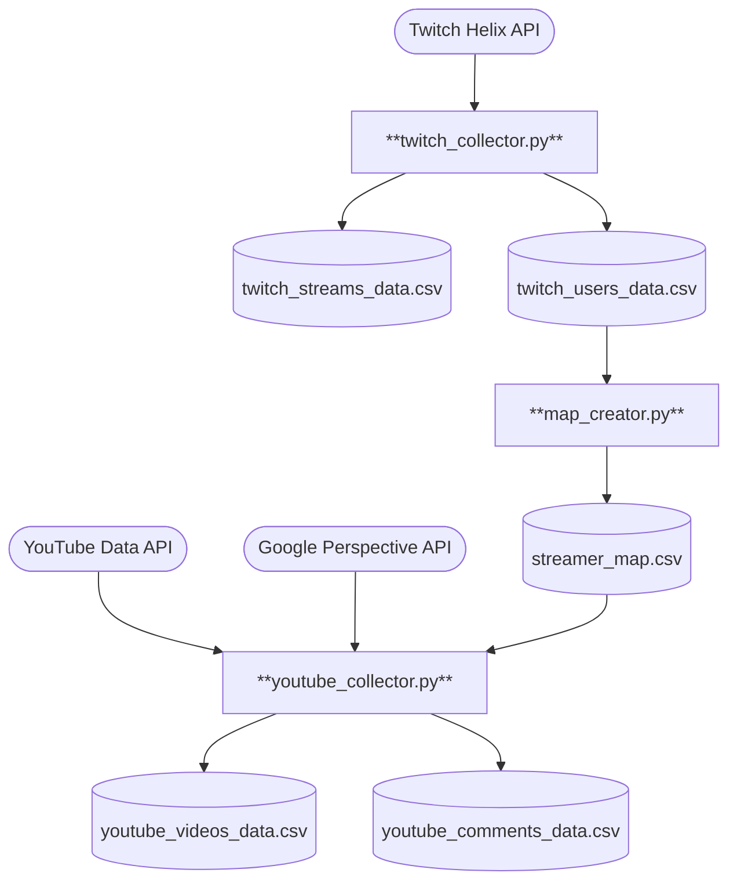

# IRL Streaming Ecosystem — Data Collection Pipeline
**Authors:** Alex Chen Hsieh & Derek Li  
**Course:** CS 415: Social Media Data Science Pipelines (Binghamton University)

## Overview
This repository contains the automated data collection pipeline powering the
[IRL Streaming Ecosystem Dashboard](https://alexmicael-irl-ecosystem-dashboard-app-wgmceg.streamlit.app/).
It continuously ingests live stream metadata from Twitch and video/comment data
from YouTube, then enriches each comment with a toxicity score via the Google
Perspective API — all managed by `cron` on a university-provided VM.

Over a 15-week semester, the pipeline collected:
- **455,535** Twitch stream snapshots across **5,597** unique streamers
- **56,291** YouTube videos and **1,527,771** comments with toxicity scores

🔗 [Dashboard Repo](https://github.com/AlexMicael/IRL-Ecosystem-Dashboard)

## Pipeline Architecture


| Script | Schedule | What it does |
|---|---|---|
| `twitch_collector.py` | Every 15 min | Fetches the top 100 live streams across the `Just Chatting`, `IRL`, and `Travel & Outdoors` categories. Appends time-series snapshots to `twitch_streams_data.csv` and new streamer profiles to `twitch_users_data.csv`. |
| `map_creator.py` | Daily at 3 AM | Reads new streamers from `twitch_users_data.csv` and uses the YouTube Search API to find their channels, saving results to `streamer_map.csv`. Rotates API keys on quota exhaustion and saves progress before exiting. |
| `youtube_collector.py` | Every 4 hrs | Polls mapped channels for the 10 most recent videos, then processes all unscored videos (including backlog). Fetches up to 100 comments per video, scores each with the Perspective API, and flushes to `youtube_comments_data.csv` in batches of 500. Uses a lock file to prevent concurrent cron collisions. |

## Output Files

| File | Description |
|---|---|
| `twitch_streams_data.csv` | Time-series snapshots of live streams (viewer count, title, category, language, started_at, etc.) |
| `twitch_users_data.csv` | Streamer profile metadata (login name, display name, description, created_at, etc.) |
| `streamer_map.csv` | Twitch login name → YouTube channel ID mappings |
| `youtube_videos_data.csv` | Video metadata for all mapped channels (title, description, published_at, etc.) |
| `youtube_comments_data.csv` | Top-level comments with Perspective API toxicity scores |

## Setup & Usage

### Prerequisites
- Python 3.x with [Miniforge](https://github.com/conda-forge/miniforge)
- API credentials for:
  - [Twitch Helix API](https://dev.twitch.tv/docs/api/)
  - [YouTube Data API v3](https://developers.google.com/youtube/v3)
  - [Google Perspective API](https://developers.perspectiveapi.com/)

### Installation

1. **Clone the repository:**
```sh
    git clone https://github.com/AlexMicael/IRL-Ecosystem-Pipeline.git
    cd IRL-Ecosystem-Pipeline
```

2. **Create and activate the Conda environment:**
```sh
    conda env create -f environment.yml
    conda activate twitch_env
```

3. **Configure API credentials** — create a `.env` file in the project root:
```env
    TWITCH_CLIENT_ID=your_twitch_client_id
    TWITCH_CLIENT_SECRET=your_twitch_client_secret
    YOUTUBE_API_KEYS=key1,key2,key3
    PERSPECTIVE_API_KEY=your_perspective_api_key
```


`YOUTUBE_API_KEYS` accepts a comma-separated list of keys. Both
`map_creator.py` and `youtube_collector.py` rotate through them
automatically when a quota is exceeded.

4. **Run a script manually (optional):**
```sh
    python twitch_collector.py
    python youtube_collector.py
    python map_creator.py
```

### Automating with cron

Add the following entries via `crontab -e`, substituting your actual paths:
```cron
# Twitch — every 15 minutes
*/15 * * * * /path/to/miniforge3/envs/twitch_env/bin/python /path/to/twitch_collector.py

# YouTube — every 4 hours
0 */4 * * * /path/to/miniforge3/envs/twitch_env/bin/python /path/to/youtube_collector.py

# Streamer mapping — daily at 3 AM
0 3 * * * /path/to/miniforge3/envs/twitch_env/bin/python /path/to/map_creator.py
```

## Implementation Notes

- **Multi-key rotation:** Both `map_creator.py` and `youtube_collector.py` accept multiple YouTube API keys via `YOUTUBE_API_KEYS`. When one key hits its daily quota, the script rotates to the next automatically. If all keys are exhausted, progress is saved and the script exits gracefully.
- **Lock file:** `youtube_collector.py` writes a `youtube_collector.lock` file on startup and removes it on exit. If the lock file exists when cron fires, the new instance exits immediately — preventing data corruption from overlapping runs.
- **Backfill logic:** On each run, `youtube_collector.py` compares all known video IDs against video IDs already present in `youtube_comments_data.csv` and processes the difference. This ensures comments are eventually collected for any video that was missed due to quota exhaustion in a prior run.
- **Batch saving:** Comments are written to disk in batches of 500, with a final flush in the `finally` block, so no data is lost if the script is interrupted mid-run.
- **Deduplication:** Streamer IDs are read with `dtype=str` to prevent type-mismatch duplicates across collection runs.
- **Security:** All API keys are stored in a `.env` file via `python-dotenv` and excluded from version control.

## Acknowledgments
This work was supported by Professor Yang at Binghamton University. We also thank the Computer Science Department for providing the virtual machine resources used to run this pipeline.